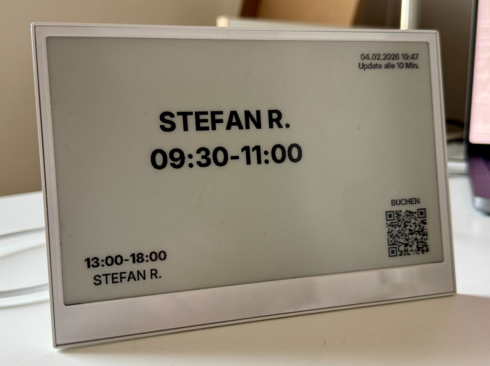

# E-Ink Raumanzeige · reTerminal E1001

**Version 1.0.1** · Raumbelegungsplan für das **reTerminal E1001** (7,5″ E-Paper, ESP32-S3). Belegungsstatus und nächste Termine aus **ICS-Kalender** (z. B. Google), Konfiguration über **WordPress**. Display aktualisiert nur bei geändertem Inhalt (Hash-Vergleich) – spart Akku.

**Hardware:** [reTerminal E1001 bei Seeed Studio](https://www.seeedstudio.com/reTerminal-E1001-p-6534.html?sensecap_affiliate=VcrMFpJ&referring_service=link) · [Zubehör Festverkabelung Stromversorgung (Amazon)](https://amzn.to/3Onrnps)



---

## Features

- **Display:** 800×480 Monochrom E-Paper, Status **BESETZT** / **NICHT BESETZT**, BIS HH:MM, bis zu 3 nächste Termine, QR-Code-Bereich
- **Backend:** WordPress-Plugin – pro Schild: Raumname, ICS-URL, WLAN, Zeitzone, Update-Intervall, Nachtmodus
- **Aktualisierung:** Pull in konfigurierbarem Intervall, **nur bei geändertem Inhalt** neues Bild → weniger Strom
- **Nachtmodus:** Intervall nachts verdoppelt (z. B. 5 Min → 10 Min)
- **Fehler-Anzeige:** Split-Screen bei keinem WLAN, niedrigem Akku (&lt; 2 %) oder Server-Ausfall; **alle 60 Sekunden** erneuter Versuch
- **Grüner Button:** manueller Refresh, weckt aus Deep Sleep bei niedrigem Akku
- **REST-API:** Display holt JSON von WordPress; WLAN/Intervall on-the-fly änderbar (kein Reflash nötig)

---

## Schnellstart

### 1. WordPress-Plugin

1. Ordner **`palestreet-raumanzeige`** nach `wp-content/plugins/` kopieren.
2. Plugin unter **Plugins** aktivieren.
3. **Einstellungen → Raumanzeige:** Zeile anlegen: Raumname, **ICS-URL** (z. B. Google Kalender „Geheime Adresse iCal“), optional QR-URL, WLAN (SSID/Passwort), Zeitzone, Update-Intervall.

### 2. Build-Paket & Flashen

1. Im WordPress-Backend: **Build-Paket herunterladen** (enthält Firmware, Skripte, bereits deine WordPress-URL).
2. ZIP entpacken, im Ordner ausführen:

```bash
cd palestreet-raumanzeige
./build-firmware.sh
```

- **Geräte-ID setzen** – wird abgefragt (0 = erste Zeile, 1 = zweite, …).
- **Automatischer Flash** – nach dem Build; mit **N** überspringen → später `./flash.sh`.
- **Gerät auswählen** – bei mehreren USB-Ports Nummer eingeben.

**Voraussetzung:** [arduino-cli](https://arduino.github.io/arduino-cli/) + ESP32-Core, [esptool](https://docs.espressif.com/projects/esptool/), optional pyserial für Bootloader-Befehl. Siehe Abschnitt [Build & Flash](#build--flash) unten.

---

## Projektstruktur

```
E-Ink-Raumbelegungs-Display/
├── README.md
├── preview/                    # Layout-Vorschau (800×480) im Browser
│   └── index.html
└── palestreet-raumanzeige/     # → wp-content/plugins/ kopieren
    ├── palestreet-raumanzeige.php
    ├── build-firmware.sh       # Firmware bauen (device_id, dann optional Flash)
    ├── flash.sh                # Nur flashen (z. B. wenn Build ohne Flash)
    ├── firmware/
    │   ├── firmware.ino        # Arduino-Sketch (XIAO ESP32S3)
    │   ├── config.example.h    # Wird im ZIP mit WordPress-URL ausgeliefert
    │   ├── data/               # 1-bit BMPs (no_wifi, low_battery, no_connection), Inter-TTF
    │   └── ...
    ├── templates/
    │   └── raum.php            # Web-Vorschau (Display-Layout + QR)
    └── includes/
        └── class-ics-parser.php
```

---

## API & Shortcodes

| Zweck | URL / Shortcode |
|------|------------------|
| **API (E-Paper)** | `GET /wp-json/palestreet-raumanzeige/v1/display?device_id=0` |
| **Web-Vorschau** | `/raumanzeige-display/?device_id=0` |
| **Shortcode Vorschau (iframe)** | `[palestreet_raumanzeige_preview device_id="0"]` |
| **Shortcode Inline** | `[palestreet_raumanzeige_display device_id="0"]` |

Die API liefert u. a. `status_label`, `status_until`, `events`, `refresh_seconds`, `content_hash`, `wifi_ssid`/`wifi_pass` (on-the-fly), `debug_display`.

---

## Build & Flash

### Voraussetzungen (lokal)

- **arduino-cli:** z. B. `brew install arduino-cli`
- **ESP32-Core:** `arduino-cli core update-index && arduino-cli core install esp32:esp32`
- **esptool:** `pip install esptool` (oder `brew install esptool`)
- **pyserial** (optional, für Bootloader-Befehl): `pip install pyserial`

### Ablauf

1. **Build-Paket** aus WordPress herunterladen und entpacken.
2. `./build-firmware.sh` – fragt **device_id**, baut Firmware (WLAN/URL aus `config.h` im ZIP).
3. Nach dem Build: **„Jetzt flashen? [j/N]“** – **j** = sofort flashen, **N** = nur bauen (später `./flash.sh`).
4. Bei mehreren USB-Ports: **Gerät per Nummer wählen** (nur das richtige Schild, sonst falsches Gerät geflasht).

**Ohne Abfragen:** `DEVICE_ID=0 ./build-firmware.sh`  
**Nur bauen (z. B. für CI):** `NONINTERACTIVE=1 DEVICE_ID=0 ./build-firmware.sh`

### Icons & Schriften

- **Fehler-Icons:** 1-bit BMP (150×150) als `no_wifi.bmp`, `low_battery.bmp`, `no_connection.bmp` in **`firmware/data/`** legen → beim Build werden sie eingebettet (`icons_data.h`). Ohne BMPs erscheinen die Texte „WLAN?“, „Akku!“, „Server?“.
- **Schriften:** `Inter_ExtraBold.ttf` und `Inter_SemiBold.ttf` in `firmware/data/` → im Ordner `firmware` einmalig `python3 ttf_to_gfx.py` (benötigt `freetype-py`). Details: `firmware/data/README.md`.

---

## Konfiguration (WordPress)

Pro Zeile (= ein Schild):

- **Raum / Bezeichnung**, **ICS-URL**, **QR-URL** (optional)
- **WLAN** (SSID, Passwort) – wird von der API ans Schild übergeben, Reflash nur bei URL/Firmware-Änderung nötig
- **Zeitzone** (z. B. `Europe/Berlin`), **Update-Intervall** (Minuten)
- **Nacht von/bis** (HH:MM) – in dem Fenster wird das Intervall verdoppelt
- **Debug-Anzeige** – auf dem Schild: Version, Hash, IP, Raum-ID, Akku %

**Löschen:** Eine Zeile = ein Schild. Die **device_id** (ID-Spalte) bleibt beim Löschen anderer Zeilen erhalten.

---

## Akku & Verhalten

- **Unter 2 % Akku:** Fehler-Split-Screen, danach **Deep Sleep**. **Grüner Button** weckt und aktualisiert.
- **WLAN/Server weg:** Fehler-Screen, **alle 60 Sekunden** erneuter Versuch (schneller wieder „online“ als beim normalen Intervall).
- **Hash-Vergleich:** Display zeichnet nur neu, wenn sich der Inhalt geändert hat.

---

## Lizenz

GPL v2 or later. Siehe [License](https://www.gnu.org/licenses/gpl-2.0.html).

---

**Version 1.0.1** – für reTerminal E1001 (XIAO ESP32S3). Getestet mit WordPress, ICS (Google Kalender). Für 1.1 sind Erweiterungen geplant.
